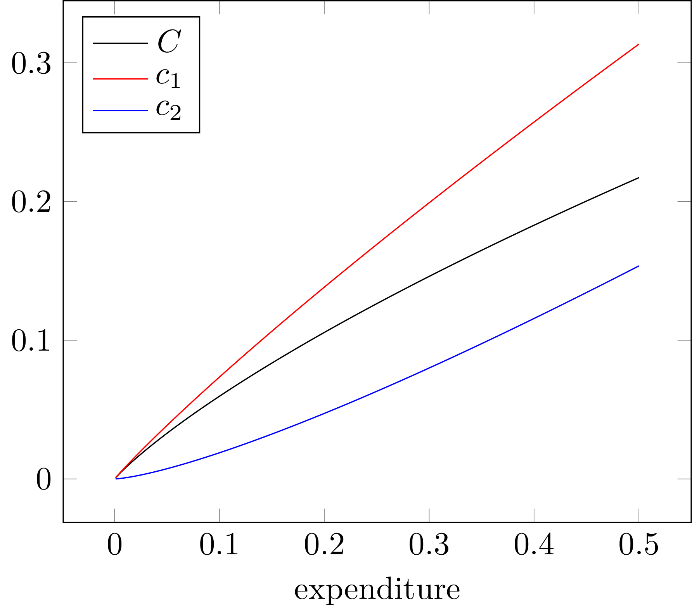

# NonhomotheticCES.jl


[](https://github.com/tpapp/NonhomotheticCES.jl/actions?query=workflow%3ACI)
[](http://codecov.io/github/tpapp/NonhomotheticCES.jl?branch=master)

A small package to solve for the consumption aggregator for non-homothetic CES preferences as described in

*Comin, D., Lashkari, D., & Mestieri, Martí (2021). Structural change with long-run income and price effects. Econometrica, 89(1), 311–374.*

## API

```julia
using NonhomotheticCES, StaticArrays

NHCES = NonhomotheticCESUtility(σ,  # σ
                                Ω̂s, # LOG sectoral Ωs
                                ϵs) # sectoral ϵs

Ĉ = log_consumption_aggregator(NHCES,
                               Ê,  # LOG expenditure
                               p̂s) # LOG prices

ĉs = log_sectoral_consumptions(NHCES, Ê, p̂s, Ĉ)
```

## Integrations

Partial derivatives are implemented for AD frameworks:

1. [X] [ForwardDiff.jl](https://github.com/JuliaDiff/ForwardDiff.jl)
2. [ ] [ChainRulesCore.jl](https://github.com/JuliaDiff/ChainRulesCore.jl) **WIP**

## Example

σ = 0.5, Ω̂₁ = 0.0, Ω̂₂ = 0.0, ϵ₁ = 1.0, ϵ₂ = 2.0, p̂₁ = 0.1, p̂₂ = 0.0 (see [script/plot.jl](./script/plot.jl)).


